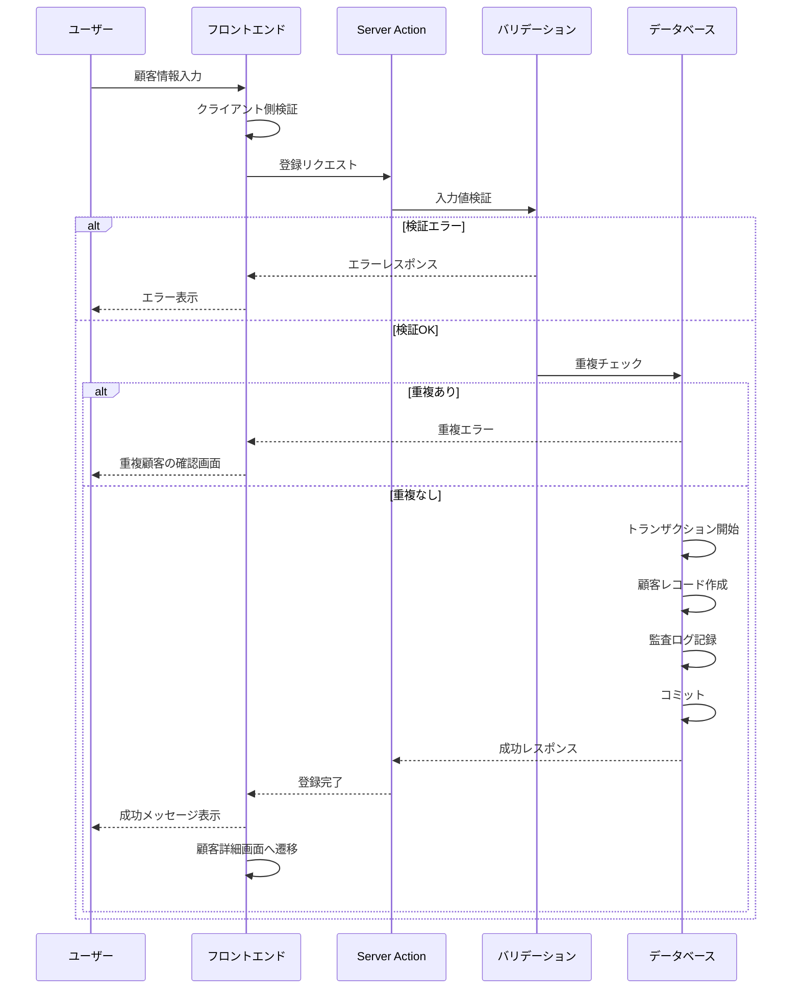

# 001: 顧客基本情報登録

## 機能概要

新規顧客の基本情報（氏名、連絡先、生年月日など）をシステムに登録する機能。顧客カルテシステムの最も基本的かつ必須の機能。

## なぜ必要なのか

### ビジネス上の必要性
- **顧客管理の起点**: すべての顧客サービスは顧客情報の登録から始まる
- **法的要件**: 個人情報の適切な管理は法律で義務付けられている
- **サービス提供の基盤**: 予約、施術、会計などすべてのサービスは顧客情報に紐づく
- **顧客体験の向上**: 正確な情報により、パーソナライズされたサービスが提供できる

### システム上の必要性
- **データの一元管理**: 顧客情報を中心にすべてのデータが紐づく
- **データ整合性**: 顧客IDを軸にした参照整合性を保つ
- **トレーサビリティ**: すべての取引や施術履歴を顧客に紐づける

## どのようなときに役立つのか

### 日常業務での活用
1. **新規来店時**
   - 初めて来店した顧客の情報を素早く登録
   - 受付からカルテ作成までスムーズに移行

2. **電話予約時**
   - 新規顧客の予約と同時に基本情報を登録
   - 来店前に顧客プロフィールを準備

3. **オンライン予約時**
   - 顧客自身が情報を入力し、自動的にシステムに登録
   - スタッフの入力作業を削減

4. **キャンペーン応募時**
   - Web経由での新規顧客獲得
   - マーケティング施策からシームレスに顧客化

### 具体的なシナリオ
**シナリオ1: 美容サロンでの新規来店**
```
受付スタッフが顧客に問診票を渡す
→ 顧客が記入
→ スタッフがシステムに入力
→ 顧客IDが自動生成
→ カルテ作成へ進む
```

**シナリオ2: オンライン予約からの新規顧客**
```
顧客がWebサイトで予約フォーム入力
→ システムが自動的に顧客情報登録
→ 予約確認メール送信
→ 来店時に顧客情報がすでに存在
```

**シナリオ3: 紹介による新規顧客**
```
既存顧客が友人を紹介
→ 紹介元情報を含めて新規登録
→ 紹介特典を自動適用
→ 紹介プログラムの効果測定
```

## 重要度評価

### 優先度: P0 (Critical - 最優先)

### 理由

1. **システムの基盤機能**
   - この機能なしでは他のすべての機能が動作しない
   - 顧客IDはすべてのテーブルの外部キーとして参照される
   - データベース設計の中心となるエンティティ

2. **ビジネスクリティカル**
   - 顧客情報がなければサービスを提供できない
   - 法的義務（個人情報保護法、GDPR等）への対応
   - 売上計上、請求、会計処理の前提条件

3. **高頻度利用**
   - 毎日、新規顧客が来店するたびに使用
   - 受付業務の必須プロセス
   - システムの入り口となる機能

4. **データ品質の起点**
   - 最初に登録される情報の品質が、その後のすべてのデータ品質に影響
   - 重複顧客の発生を防ぐ
   - 正確な顧客情報がマーケティング効果を左右

5. **投資対効果**
   - 開発コストは中程度
   - ビジネスインパクトは最大
   - ROIは非常に高い

## 基本設計

### システム構成

```
┌─────────────────┐
│   フロントエンド   │
│  (Next.js App)    │
└────────┬─────────┘
         │
         ↓ Server Action / API
┌─────────────────┐
│  バックエンド     │
│ (Server Action)  │
└────────┬─────────┘
         │
         ↓ SQL Query
┌─────────────────┐
│   データベース    │
│   (PostgreSQL)   │
└─────────────────┘
```

### データ構造

#### customersテーブル

```typescript
type Customer = {
  // 基本識別情報
  id: string; // UUID, Primary Key
  customerNumber: string; // 顧客番号（表示用）, Unique

  // 個人情報
  lastName: string; // 姓
  firstName: string; // 名
  lastNameKana: string | null; // 姓（カナ）
  firstNameKana: string | null; // 名（カナ）
  gender: 'male' | 'female' | 'other' | 'prefer_not_to_say' | null;
  dateOfBirth: Date | null;

  // 連絡先情報
  email: string | null; // Unique where not null
  phoneNumber: string | null;
  mobileNumber: string | null;

  // 住所情報
  postalCode: string | null;
  prefecture: string | null;
  city: string | null;
  address1: string | null;
  address2: string | null;

  // 緊急連絡先
  emergencyContactName: string | null;
  emergencyContactPhone: string | null;
  emergencyContactRelation: string | null;

  // ステータス・分類
  status: 'active' | 'inactive' | 'suspended'; // デフォルト: active
  customerRank: string | null; // 'bronze', 'silver', 'gold', 'platinum'
  tags: string[]; // 顧客タグ配列

  // メタデータ
  notes: string | null; // 内部メモ
  referralSource: string | null; // 紹介元
  referralCustomerId: string | null; // 紹介元顧客ID

  // システム管理情報
  createdAt: Date; // 作成日時
  updatedAt: Date; // 更新日時
  createdBy: string; // 作成者（スタッフID）
  updatedBy: string; // 更新者（スタッフID）
  deletedAt: Date | null; // 論理削除日時
};
```

#### インデックス設計

```sql
-- 主キー
PRIMARY KEY (id)

-- ユニーク制約
UNIQUE (customerNumber)
UNIQUE (email) WHERE email IS NOT NULL

-- 検索用インデックス
INDEX idx_customers_name (lastName, firstName)
INDEX idx_customers_kana (lastNameKana, firstNameKana)
INDEX idx_customers_phone (phoneNumber)
INDEX idx_customers_mobile (mobileNumber)
INDEX idx_customers_status (status) WHERE deletedAt IS NULL
INDEX idx_customers_created (createdAt DESC)

-- 全文検索用（PostgreSQL）
INDEX idx_customers_search USING gin(
  to_tsvector('japanese', lastName || ' ' || firstName || ' ' ||
              COALESCE(lastNameKana, '') || ' ' || COALESCE(firstNameKana, ''))
)
```

### 処理フロー

#### 1. 新規登録フロー



#### 2. 重複チェックロジック

```typescript
function checkDuplicateCustomer(input: CustomerInput): DuplicateCheck {
  const checks = {
    exactMatch: false,
    possibleDuplicates: [],
  };

  // 1. メールアドレスの完全一致チェック
  if (input.email) {
    exactMatch = await db.customers.findUnique({
      where: { email: input.email }
    });
    if (exactMatch) return { exactMatch: true, customer: exactMatch };
  }

  // 2. 電話番号の完全一致チェック
  if (input.phoneNumber || input.mobileNumber) {
    exactMatch = await db.customers.findFirst({
      where: {
        OR: [
          { phoneNumber: input.phoneNumber },
          { mobileNumber: input.mobileNumber },
        ]
      }
    });
    if (exactMatch) return { exactMatch: true, customer: exactMatch };
  }

  // 3. 名前の曖昧一致チェック（類似顧客の検出）
  possibleDuplicates = await db.customers.findMany({
    where: {
      AND: [
        { lastName: input.lastName },
        { firstName: input.firstName },
        { deletedAt: null },
      ]
    }
  });

  // 4. 名前のあいまい一致（レーベンシュタイン距離）
  if (possibleDuplicates.length === 0 && input.lastNameKana) {
    possibleDuplicates = await findSimilarNames(
      input.lastName,
      input.firstName,
      threshold: 0.8
    );
  }

  return { exactMatch: false, possibleDuplicates };
}
```

## 詳細設計

### API仕様

#### Server Action: createCustomer

```typescript
/**
 * 新規顧客を登録する
 * @param input 顧客登録情報
 * @returns 作成された顧客情報
 */
async function createCustomer(
  input: CreateCustomerInput
): Promise<Result<Customer, ValidationError[]>> {
  // 1. 認証チェック
  const session = await getSession();
  if (!session) {
    return { success: false, error: 'Unauthorized' };
  }

  // 2. 権限チェック
  if (!hasPermission(session.user, 'customer:create')) {
    return { success: false, error: 'Forbidden' };
  }

  // 3. 入力値検証
  const validation = validateCustomerInput(input);
  if (!validation.success) {
    return { success: false, errors: validation.errors };
  }

  // 4. 重複チェック
  const duplicateCheck = await checkDuplicateCustomer(input);
  if (duplicateCheck.exactMatch) {
    return {
      success: false,
      error: 'Customer already exists',
      existingCustomer: duplicateCheck.customer
    };
  }

  // 5. 顧客番号生成
  const customerNumber = await generateCustomerNumber();

  // 6. データベース登録
  try {
    const customer = await db.transaction(async (tx) => {
      // 顧客レコード作成
      const newCustomer = await tx.customers.create({
        data: {
          customerNumber,
          ...input,
          status: 'active',
          createdBy: session.user.id,
          updatedBy: session.user.id,
        }
      });

      // 監査ログ記録
      await tx.auditLogs.create({
        data: {
          action: 'customer.create',
          userId: session.user.id,
          resourceType: 'customer',
          resourceId: newCustomer.id,
          details: { customerNumber: newCustomer.customerNumber },
        }
      });

      return newCustomer;
    });

    // 7. キャッシュ無効化
    revalidateTag('customers');

    return { success: true, data: customer };

  } catch (error) {
    logger.error('Failed to create customer', { error, input });
    return { success: false, error: 'Database error' };
  }
}
```

#### バリデーションスキーマ

```typescript
import { z } from 'zod';

const CreateCustomerSchema = z.object({
  // 必須項目
  lastName: z.string()
    .min(1, '姓を入力してください')
    .max(50, '姓は50文字以内で入力してください'),

  firstName: z.string()
    .min(1, '名を入力してください')
    .max(50, '名は50文字以内で入力してください'),

  // 任意項目（バリデーションあり）
  lastNameKana: z.string()
    .max(50)
    .regex(/^[ァ-ヶー]*$/, 'カタカナで入力してください')
    .optional()
    .nullable(),

  firstNameKana: z.string()
    .max(50)
    .regex(/^[ァ-ヶー]*$/, 'カタカナで入力してください')
    .optional()
    .nullable(),

  email: z.string()
    .email('有効なメールアドレスを入力してください')
    .max(255)
    .optional()
    .nullable(),

  phoneNumber: z.string()
    .regex(/^0\d{9,10}$/, '有効な電話番号を入力してください')
    .optional()
    .nullable(),

  mobileNumber: z.string()
    .regex(/^0[789]0-?\d{4}-?\d{4}$/, '有効な携帯電話番号を入力してください')
    .optional()
    .nullable(),

  gender: z.enum(['male', 'female', 'other', 'prefer_not_to_say'])
    .optional()
    .nullable(),

  dateOfBirth: z.date()
    .max(new Date(), '未来の日付は設定できません')
    .optional()
    .nullable(),

  postalCode: z.string()
    .regex(/^\d{3}-?\d{4}$/, '有効な郵便番号を入力してください')
    .optional()
    .nullable(),

  prefecture: z.string()
    .max(10)
    .optional()
    .nullable(),

  city: z.string()
    .max(50)
    .optional()
    .nullable(),

  address1: z.string()
    .max(100)
    .optional()
    .nullable(),

  address2: z.string()
    .max(100)
    .optional()
    .nullable(),

  emergencyContactName: z.string()
    .max(100)
    .optional()
    .nullable(),

  emergencyContactPhone: z.string()
    .regex(/^0\d{9,10}$/)
    .optional()
    .nullable(),

  emergencyContactRelation: z.string()
    .max(50)
    .optional()
    .nullable(),

  referralSource: z.string()
    .max(100)
    .optional()
    .nullable(),

  referralCustomerId: z.string()
    .uuid()
    .optional()
    .nullable(),

  notes: z.string()
    .max(1000)
    .optional()
    .nullable(),

}).refine(
  (data) => data.email || data.phoneNumber || data.mobileNumber,
  {
    message: 'メールアドレスまたは電話番号のいずれかを入力してください',
    path: ['email'],
  }
);

type CreateCustomerInput = z.infer<typeof CreateCustomerSchema>;
```

### UI/UX設計

#### コンポーネント構成

```typescript
// 親コンテナ
function CustomerRegistrationPage() {
  return (
    <div className="container mx-auto p-4">
      <PageHeader title="新規顧客登録" />
      <CustomerRegistrationForm />
    </div>
  );
}

// フォームコンポーネント
function CustomerRegistrationForm() {
  const [duplicateCheck, setDuplicateCheck] = useState(null);

  return (
    <Form>
      <CustomerBasicInfoSection />
      <CustomerContactSection />
      <CustomerAddressSection />
      <EmergencyContactSection />
      <AdditionalInfoSection />

      {duplicateCheck && (
        <DuplicateWarningDialog
          duplicates={duplicateCheck.possibleDuplicates}
        />
      )}

      <FormActions />
    </Form>
  );
}
```

#### フォームレイアウト

```
┌──────────────────────────────────────────┐
│          新規顧客登録                      │
├──────────────────────────────────────────┤
│                                          │
│  基本情報                                 │
│  ┌──────────┐ ┌──────────┐             │
│  │  姓 *     │ │  名 *     │             │
│  └──────────┘ └──────────┘             │
│  ┌──────────┐ ┌──────────┐             │
│  │セイ       │ │メイ       │             │
│  └──────────┘ └──────────┘             │
│  ┌──────────┐ ┌──────────┐             │
│  │性別       │ │生年月日   │             │
│  └──────────┘ └──────────┘             │
│                                          │
│  連絡先情報                               │
│  ┌────────────────────────┐             │
│  │メールアドレス *            │             │
│  └────────────────────────┘             │
│  ┌──────────┐ ┌──────────┐             │
│  │電話番号   │ │携帯電話   │             │
│  └──────────┘ └──────────┘             │
│                                          │
│  住所情報（任意）                         │
│  [展開する ▼]                            │
│                                          │
│  緊急連絡先（任意）                       │
│  [展開する ▼]                            │
│                                          │
│  追加情報（任意）                         │
│  [展開する ▼]                            │
│                                          │
├──────────────────────────────────────────┤
│  [キャンセル]           [登録する]       │
└──────────────────────────────────────────┘
```

#### UXの考慮点

1. **段階的な情報開示**
   - 必須項目は常に表示
   - 任意項目はアコーディオンで折りたたみ可能
   - 進捗インジケーターで入力状況を可視化

2. **リアルタイムバリデーション**
   - onBlurでバリデーション実行
   - エラーはフィールド直下に表示
   - 成功時はチェックマークを表示

3. **スマート入力支援**
   - 郵便番号から住所自動入力
   - 電話番号の自動フォーマット
   - ふりがな自動入力（日本語IMEから）

4. **重複防止**
   - 名前+電話番号入力後に重複チェック
   - 類似顧客がいる場合は警告ダイアログ
   - 既存顧客の詳細を表示して確認可能

5. **アクセシビリティ**
   - すべてのフィールドにラベル
   - キーボードナビゲーション対応
   - スクリーンリーダー対応
   - 高コントラストモード対応

### 実装詳細

#### ディレクトリ構造

```
packages/customer/
├── src/
│   ├── actions/
│   │   ├── create-customer.ts
│   │   ├── check-duplicate.ts
│   │   └── generate-customer-number.ts
│   ├── components/
│   │   ├── customer-registration-form.tsx
│   │   ├── customer-basic-info-section.tsx
│   │   ├── customer-contact-section.tsx
│   │   ├── duplicate-warning-dialog.tsx
│   │   └── form-actions.tsx
│   ├── schemas/
│   │   └── customer-schema.ts
│   ├── types/
│   │   └── customer.ts
│   └── utils/
│       ├── validation.ts
│       └── formatting.ts
└── tests/
    ├── unit/
    │   ├── create-customer.test.ts
    │   └── validation.test.ts
    └── integration/
        └── customer-registration.test.ts
```

#### 顧客番号生成ロジック

```typescript
/**
 * 顧客番号を生成
 * フォーマット: C + YYYYMMDD + 4桁連番
 * 例: C202401010001
 */
async function generateCustomerNumber(): Promise<string> {
  const today = new Date();
  const datePrefix = format(today, 'yyyyMMdd');

  // 今日作成された最後の顧客番号を取得
  const lastCustomer = await db.customers.findFirst({
    where: {
      customerNumber: {
        startsWith: `C${datePrefix}`
      }
    },
    orderBy: {
      customerNumber: 'desc'
    },
    select: {
      customerNumber: true
    }
  });

  let sequence = 1;
  if (lastCustomer) {
    // 既存の連番から+1
    const lastSequence = parseInt(
      lastCustomer.customerNumber.slice(-4)
    );
    sequence = lastSequence + 1;
  }

  // 4桁0埋め
  const sequenceStr = sequence.toString().padStart(4, '0');

  return `C${datePrefix}${sequenceStr}`;
}
```

#### 重複チェックの最適化

```typescript
/**
 * 段階的な重複チェック
 * 1. 完全一致（メール、電話）→ 即座にブロック
 * 2. 名前の一致 → 警告表示
 * 3. あいまい一致 → 推奨として表示
 */
async function checkDuplicateCustomer(
  input: CreateCustomerInput
): Promise<DuplicateCheckResult> {
  // メールアドレスの重複チェック（最優先）
  if (input.email) {
    const existingByEmail = await db.customers.findUnique({
      where: {
        email: input.email,
        deletedAt: null
      }
    });

    if (existingByEmail) {
      return {
        level: 'error',
        type: 'email',
        customer: existingByEmail,
        message: 'このメールアドレスは既に登録されています'
      };
    }
  }

  // 電話番号の重複チェック
  if (input.phoneNumber || input.mobileNumber) {
    const existingByPhone = await db.customers.findFirst({
      where: {
        OR: [
          { phoneNumber: input.phoneNumber },
          { mobileNumber: input.mobileNumber }
        ],
        deletedAt: null
      }
    });

    if (existingByPhone) {
      return {
        level: 'error',
        type: 'phone',
        customer: existingByPhone,
        message: 'この電話番号は既に登録されています'
      };
    }
  }

  // 名前の完全一致チェック（警告レベル）
  const similarCustomers = await db.$queryRaw`
    SELECT *
    FROM customers
    WHERE deleted_at IS NULL
      AND last_name = ${input.lastName}
      AND first_name = ${input.firstName}
      AND (
        date_of_birth IS NULL
        OR date_of_birth = ${input.dateOfBirth}
      )
    LIMIT 5
  `;

  if (similarCustomers.length > 0) {
    return {
      level: 'warning',
      type: 'name',
      customers: similarCustomers,
      message: '同姓同名の顧客が既に登録されています。同一人物でないか確認してください。'
    };
  }

  // あいまい一致チェック（情報レベル）
  if (input.lastNameKana && input.firstNameKana) {
    const fuzzyMatches = await db.$queryRaw`
      SELECT *,
        similarity(
          last_name_kana || first_name_kana,
          ${input.lastNameKana + input.firstNameKana}
        ) as similarity_score
      FROM customers
      WHERE deleted_at IS NULL
        AND similarity(
          last_name_kana || first_name_kana,
          ${input.lastNameKana + input.firstNameKana}
        ) > 0.7
      ORDER BY similarity_score DESC
      LIMIT 3
    `;

    if (fuzzyMatches.length > 0) {
      return {
        level: 'info',
        type: 'fuzzy',
        customers: fuzzyMatches,
        message: '名前が似ている顧客が見つかりました。'
      };
    }
  }

  return { level: 'ok' };
}
```

### セキュリティ考慮事項

#### 1. 個人情報保護

```typescript
// 個人情報フィールドの暗号化
const sensitiveFields = [
  'email',
  'phoneNumber',
  'mobileNumber',
  'address1',
  'address2',
  'emergencyContactPhone'
];

// データベース保存前に暗号化
async function encryptSensitiveData(data: CustomerInput) {
  const encrypted = { ...data };

  for (const field of sensitiveFields) {
    if (encrypted[field]) {
      encrypted[field] = await encrypt(encrypted[field]);
    }
  }

  return encrypted;
}

// 取得時に復号化
async function decryptSensitiveData(data: Customer) {
  const decrypted = { ...data };

  for (const field of sensitiveFields) {
    if (decrypted[field]) {
      decrypted[field] = await decrypt(decrypted[field]);
    }
  }

  return decrypted;
}
```

#### 2. アクセス制御

```typescript
// ロールベースアクセス制御
const permissions = {
  'customer:create': ['admin', 'staff', 'receptionist'],
  'customer:read': ['admin', 'staff', 'receptionist'],
  'customer:update': ['admin', 'staff'],
  'customer:delete': ['admin'],
};

function hasPermission(user: User, permission: string): boolean {
  const allowedRoles = permissions[permission];
  return allowedRoles.includes(user.role);
}
```

#### 3. 入力値のサニタイゼーション

```typescript
function sanitizeInput(input: string): string {
  return input
    .trim()
    .replace(/[<>]/g, '') // XSS対策
    .replace(/[\u0000-\u001F\u007F-\u009F]/g, ''); // 制御文字除去
}
```

#### 4. CSRFトークン

```typescript
// Next.jsのServer Actionは自動的にCSRF保護される
// 追加の検証が必要な場合
async function createCustomer(input: CreateCustomerInput) {
  const session = await getServerSession();

  if (!session?.csrfToken) {
    throw new Error('Invalid CSRF token');
  }

  // 処理続行...
}
```

#### 5. レート制限

```typescript
import { ratelimit } from '@/lib/rate-limit';

async function createCustomer(input: CreateCustomerInput) {
  const session = await getSession();

  // IPアドレスベースのレート制限
  const { success, remaining } = await ratelimit.limit(
    `customer:create:${session.user.id}`,
    {
      limit: 10, // 10回
      window: '1h' // 1時間あたり
    }
  );

  if (!success) {
    throw new TooManyRequestsError(
      '登録回数が制限を超えました。しばらく待ってから再試行してください。'
    );
  }

  // 処理続行...
}
```

### パフォーマンス考慮事項

#### 1. データベースクエリの最適化

```typescript
// インデックスを活用した高速検索
await db.customers.findMany({
  where: {
    AND: [
      { lastName: input.lastName },
      { firstName: input.firstName },
      { deletedAt: null }
    ]
  }
  // idx_customers_name インデックスが使用される
});

// N+1問題の回避
const customersWithReferrals = await db.customers.findMany({
  include: {
    referredBy: true, // リレーション先を一度に取得
    appointments: {
      take: 5,
      orderBy: { date: 'desc' }
    }
  }
});
```

#### 2. キャッシング戦略

```typescript
// 顧客一覧のキャッシュ（頻繁にアクセスされる）
async function getCustomers() {
  'use cache: remote';
  cacheLife('hours');
  cacheTag('customers');

  return await db.customers.findMany({
    where: { deletedAt: null },
    orderBy: { createdAt: 'desc' }
  });
}

// 登録時にキャッシュ無効化
async function createCustomer(input: CreateCustomerInput) {
  const customer = await db.customers.create({ data: input });

  revalidateTag('customers'); // キャッシュクリア

  return customer;
}
```

#### 3. 楽観的UI更新

```typescript
'use client';

function CustomerRegistrationForm() {
  const [optimisticCustomers, setOptimisticCustomers] = useOptimistic(
    customers,
    (state, newCustomer) => [newCustomer, ...state]
  );

  async function handleSubmit(data: CreateCustomerInput) {
    // 即座にUIを更新（楽観的）
    setOptimisticCustomers({
      id: 'temp-' + Date.now(),
      ...data,
      status: 'pending'
    });

    try {
      // サーバーに送信
      const result = await createCustomer(data);

      // 成功時は自動的に revalidate される
      toast.success('顧客を登録しました');
      router.push(`/customers/${result.id}`);

    } catch (error) {
      // 失敗時はロールバック
      toast.error('登録に失敗しました');
    }
  }
}
```

#### 4. バンドルサイズの最適化

```typescript
// 動的インポートで初期ロードを高速化
const DuplicateWarningDialog = dynamic(
  () => import('./duplicate-warning-dialog'),
  {
    loading: () => <Skeleton className="h-48" />,
    ssr: false // クライアントサイドのみで必要
  }
);

// 大きなライブラリは遅延ロード
const loadPhoneNumberValidator = async () => {
  const { parsePhoneNumber } = await import('libphonenumber-js');
  return parsePhoneNumber;
};
```

### テスト方針

#### 1. ユニットテスト

```typescript
// packages/customer/tests/unit/create-customer.test.ts
describe('createCustomer', () => {
  describe('バリデーション', () => {
    it('必須項目が欠けている場合はエラーを返す', async () => {
      const result = await createCustomer({
        firstName: '太郎',
        // lastName が欠けている
      });

      expect(result.success).toBe(false);
      expect(result.errors).toContainEqual({
        field: 'lastName',
        message: '姓を入力してください'
      });
    });

    it('無効なメールアドレスの場合はエラーを返す', async () => {
      const result = await createCustomer({
        lastName: '山田',
        firstName: '太郎',
        email: 'invalid-email'
      });

      expect(result.success).toBe(false);
      expect(result.errors).toContainEqual({
        field: 'email',
        message: '有効なメールアドレスを入力してください'
      });
    });
  });

  describe('重複チェック', () => {
    beforeEach(async () => {
      await db.customers.create({
        data: {
          customerNumber: 'C202401010001',
          lastName: '山田',
          firstName: '太郎',
          email: 'yamada@example.com',
          createdBy: 'test-user',
          updatedBy: 'test-user',
        }
      });
    });

    it('同じメールアドレスの顧客が存在する場合はエラーを返す', async () => {
      const result = await createCustomer({
        lastName: '佐藤',
        firstName: '花子',
        email: 'yamada@example.com' // 重複
      });

      expect(result.success).toBe(false);
      expect(result.error).toBe('Customer already exists');
    });

    it('同姓同名でもメールが異なれば登録できる', async () => {
      const result = await createCustomer({
        lastName: '山田',
        firstName: '太郎',
        email: 'yamada2@example.com'
      });

      expect(result.success).toBe(true);
    });
  });

  describe('顧客番号生成', () => {
    it('正しいフォーマットの顧客番号が生成される', async () => {
      const customerNumber = await generateCustomerNumber();

      expect(customerNumber).toMatch(/^C\d{8}\d{4}$/);
      expect(customerNumber).toStartWith('C20240101'); // 今日の日付
    });

    it('連番が正しくインクリメントされる', async () => {
      const number1 = await generateCustomerNumber();
      await db.customers.create({
        data: {
          customerNumber: number1,
          lastName: 'Test',
          firstName: 'User',
          createdBy: 'test',
          updatedBy: 'test',
        }
      });

      const number2 = await generateCustomerNumber();

      const seq1 = parseInt(number1.slice(-4));
      const seq2 = parseInt(number2.slice(-4));

      expect(seq2).toBe(seq1 + 1);
    });
  });
});
```

#### 2. 統合テスト

```typescript
// packages/customer/tests/integration/customer-registration.test.ts
describe('顧客登録フロー（統合テスト）', () => {
  let testUser: User;

  beforeEach(async () => {
    // テストユーザーを作成
    testUser = await createTestUser({
      role: 'staff',
      permissions: ['customer:create']
    });
  });

  it('新規顧客登録の完全なフロー', async () => {
    // 1. フォーム入力
    const customerData = {
      lastName: '山田',
      firstName: '太郎',
      lastNameKana: 'ヤマダ',
      firstNameKana: 'タロウ',
      email: 'yamada@example.com',
      phoneNumber: '0312345678',
      gender: 'male',
      dateOfBirth: new Date('1990-01-01'),
    };

    // 2. 重複チェック
    const duplicateCheck = await checkDuplicateCustomer(customerData);
    expect(duplicateCheck.level).toBe('ok');

    // 3. 登録実行
    const result = await createCustomer(customerData);
    expect(result.success).toBe(true);

    const customer = result.data;
    expect(customer.id).toBeDefined();
    expect(customer.customerNumber).toMatch(/^C\d{12}$/);
    expect(customer.lastName).toBe('山田');
    expect(customer.createdBy).toBe(testUser.id);

    // 4. データベースに保存されているか確認
    const savedCustomer = await db.customers.findUnique({
      where: { id: customer.id }
    });
    expect(savedCustomer).not.toBeNull();
    expect(savedCustomer.email).toBe('yamada@example.com');

    // 5. 監査ログが記録されているか確認
    const auditLog = await db.auditLogs.findFirst({
      where: {
        resourceType: 'customer',
        resourceId: customer.id,
        action: 'customer.create'
      }
    });
    expect(auditLog).not.toBeNull();
    expect(auditLog.userId).toBe(testUser.id);
  });

  it('権限がないユーザーは登録できない', async () => {
    const unauthorizedUser = await createTestUser({
      role: 'viewer',
      permissions: [] // 権限なし
    });

    const result = await createCustomer({
      lastName: '山田',
      firstName: '太郎',
    });

    expect(result.success).toBe(false);
    expect(result.error).toBe('Forbidden');
  });
});
```

#### 3. E2Eテスト

```typescript
// tests/e2e/customer-registration.spec.ts
import { test, expect } from '@playwright/test';

test.describe('顧客登録', () => {
  test.beforeEach(async ({ page }) => {
    // ログイン
    await page.goto('/login');
    await page.fill('[name="email"]', 'staff@example.com');
    await page.fill('[name="password"]', 'password');
    await page.click('button[type="submit"]');

    // 顧客登録ページへ遷移
    await page.goto('/customers/new');
  });

  test('新規顧客を登録できる', async ({ page }) => {
    // フォーム入力
    await page.fill('[name="lastName"]', '山田');
    await page.fill('[name="firstName"]', '太郎');
    await page.fill('[name="lastNameKana"]', 'ヤマダ');
    await page.fill('[name="firstNameKana"]', 'タロウ');
    await page.fill('[name="email"]', 'yamada@example.com');
    await page.fill('[name="phoneNumber"]', '03-1234-5678');

    // 性別選択
    await page.selectOption('[name="gender"]', 'male');

    // 生年月日入力
    await page.fill('[name="dateOfBirth"]', '1990-01-01');

    // 登録ボタンクリック
    await page.click('button[type="submit"]');

    // 成功メッセージ表示
    await expect(page.locator('.toast-success')).toContainText(
      '顧客を登録しました'
    );

    // 顧客詳細ページへリダイレクト
    await expect(page).toHaveURL(/\/customers\/[a-f0-9-]+/);

    // 登録した情報が表示されている
    await expect(page.locator('h1')).toContainText('山田 太郎');
    await expect(page.locator('[data-testid="email"]')).toContainText(
      'yamada@example.com'
    );
  });

  test('必須項目が未入力の場合はエラーが表示される', async ({ page }) => {
    // 名前を入力せずに登録ボタンをクリック
    await page.click('button[type="submit"]');

    // エラーメッセージが表示される
    await expect(page.locator('[data-error="lastName"]')).toContainText(
      '姓を入力してください'
    );
    await expect(page.locator('[data-error="firstName"]')).toContainText(
      '名を入力してください'
    );
  });

  test('重複する顧客の警告が表示される', async ({ page }) => {
    // 既存顧客と同じ情報を入力
    await page.fill('[name="lastName"]', '既存');
    await page.fill('[name="firstName"]', '顧客');
    await page.fill('[name="email"]', 'existing@example.com');

    // メールフィールドからフォーカスを外す（onBlurトリガー）
    await page.click('[name="phoneNumber"]');

    // 重複警告ダイアログが表示される
    await expect(page.locator('[role="dialog"]')).toBeVisible();
    await expect(page.locator('[role="dialog"]')).toContainText(
      'このメールアドレスは既に登録されています'
    );

    // 既存顧客の情報が表示される
    await expect(page.locator('[data-testid="existing-customer"]'))
      .toContainText('既存 顧客');
  });

  test('郵便番号から住所が自動入力される', async ({ page }) => {
    // 郵便番号を入力
    await page.fill('[name="postalCode"]', '100-0001');

    // 住所検索ボタンをクリック
    await page.click('[data-testid="search-address"]');

    // 住所が自動入力される
    await expect(page.locator('[name="prefecture"]')).toHaveValue('東京都');
    await expect(page.locator('[name="city"]')).toHaveValue('千代田区');
    await expect(page.locator('[name="address1"]')).toContainValue('千代田');
  });
});
```

#### 4. パフォーマンステスト

```typescript
// tests/performance/customer-registration.bench.ts
import { bench, describe } from 'vitest';

describe('顧客登録のパフォーマンス', () => {
  bench('1件の顧客登録', async () => {
    await createCustomer({
      lastName: 'パフォーマンス',
      firstName: 'テスト',
      email: `perf-${Date.now()}@example.com`,
    });
  });

  bench('100件の顧客を一括登録', async () => {
    const customers = Array.from({ length: 100 }, (_, i) => ({
      lastName: 'バッチ',
      firstName: `テスト${i}`,
      email: `batch-${Date.now()}-${i}@example.com`,
    }));

    await Promise.all(customers.map(createCustomer));
  });

  bench('重複チェック（10,000件のデータベース）', async () => {
    // 10,000件の顧客データが存在する状態で
    await checkDuplicateCustomer({
      lastName: '山田',
      firstName: '太郎',
      email: 'test@example.com',
    });
  });
});
```

### カバレッジ目標

- **ユニットテスト**: 90%以上
- **統合テスト**: 主要フロー100%
- **E2Eテスト**: クリティカルパス100%

### 非機能要件

#### パフォーマンス
- **登録処理**: 500ms以内
- **重複チェック**: 200ms以内
- **フォーム初期表示**: 1秒以内

#### 可用性
- **稼働率**: 99.9%以上
- **エラー率**: 0.1%以下

#### スケーラビリティ
- **同時登録**: 100リクエスト/秒まで対応
- **データベース**: 100万件の顧客データまでパフォーマンス劣化なし

## まとめ

顧客基本情報登録機能は、顧客カルテシステムの最も基本的かつ重要な機能です。

### 重要ポイント
1. **データ品質**: 正確な顧客情報がすべての基盤
2. **セキュリティ**: 個人情報保護は最優先事項
3. **UX**: 素早く、正確に、ストレスなく登録できる体験
4. **重複防止**: データの整合性を保つための重複チェック
5. **拡張性**: 将来的な機能追加に対応できる設計

### 成功指標
- 登録完了率: 95%以上
- 重複顧客発生率: 1%以下
- 平均登録時間: 2分以内
- ユーザー満足度: 4.5/5.0以上
