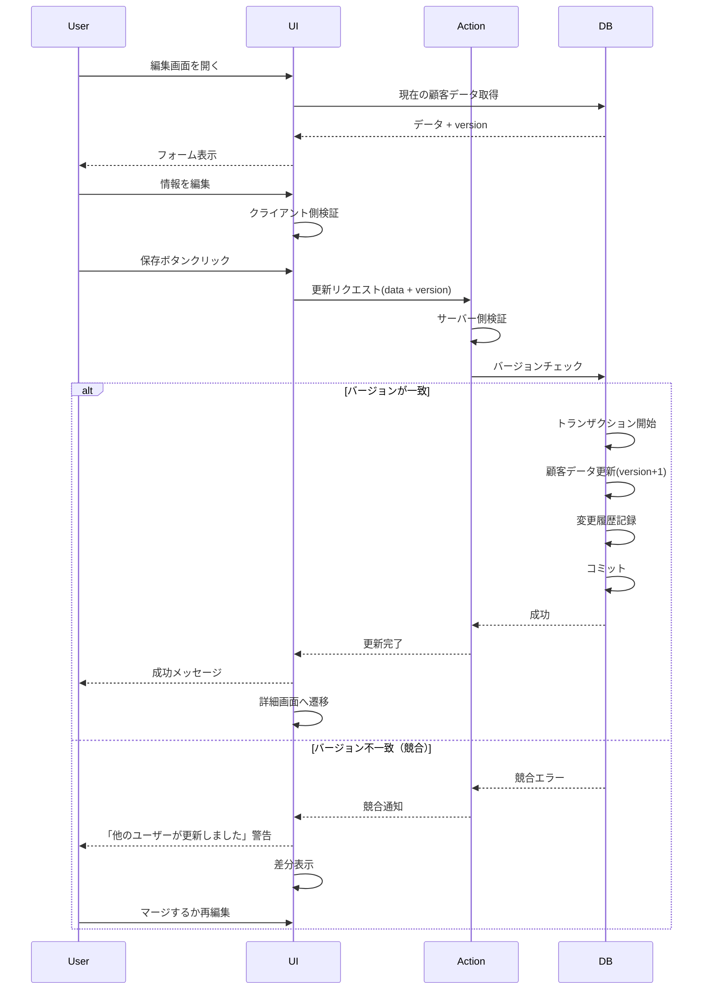

# 004: 顧客情報編集

## 機能概要

登録済みの顧客情報を更新・修正する機能。連絡先変更、住所変更、ステータス変更など、顧客情報のライフサイクル管理に必須の機能。変更履歴を記録し、データの整合性を保つ。

## なぜ必要なのか

### ビジネス上の必要性
- **情報の最新性維持**: 連絡先や住所などの変更に対応
- **データ品質向上**: 誤入力の修正、情報の補完
- **顧客満足度向上**: 最新情報で正確なサービス提供
- **法的コンプライアンス**: 個人情報の訂正要求への対応（GDPR等）

### システム上の必要性
- **データの整合性**: 参照整合性を保ちながら更新
- **監査証跡**: 誰がいつ何を変更したかの記録
- **競合制御**: 同時編集による データ破損の防止

## どのようなときに役立つのか

### 日常業務での活用

1. **顧客からの情報変更依頼**
   ```
   顧客: 「引っ越したので住所を変更してください」
   スタッフ: 詳細画面 → 編集ボタン → 住所フィールド更新
   → 保存 → 変更履歴記録
   ```

2. **誤入力の修正**
   ```
   スタッフが入力ミスに気づく
   → 詳細画面 → 編集
   → 正しい情報に修正
   → 保存
   ```

3. **情報の補完**
   ```
   初回登録時に最小限の情報のみ入力
   → 後日、詳細情報を追加
   → メールアドレス、生年月日などを補完
   ```

4. **ステータス変更**
   ```
   長期未来店の顧客
   → ステータスを「inactive」に変更
   → 再来店時に「active」に戻す
   ```

5. **顧客ランクの更新**
   ```
   累計利用額が基準到達
   → 顧客ランクを「ゴールド」に昇格
   → 特典の適用
   ```

### 具体的なシナリオ

**シナリオ1: 電話番号の変更**
```
顧客が来店時に「携帯番号が変わりました」
↓
スタッフが詳細画面から編集画面へ
↓
新しい電話番号を入力
↓
重複チェック（他の顧客と重複していないか）
↓
保存 → 変更履歴に記録
↓
次回から新しい番号で連絡可能
```

**シナリオ2: アレルギー情報の追加**
```
カウンセリングで新たなアレルギーが判明
↓
施術前に編集画面でアレルギー情報を追加
↓
⚠️ 警告表示を設定
↓
次回以降、詳細画面で目立つ警告表示
↓
安全な施術の提供
```

**シナリオ3: 同時編集の競合**
```
スタッフA: 電話番号を編集中
スタッフB: 同時に住所を編集開始
↓
スタッフAが保存
↓
スタッフBが保存しようとする
↓
システム: 「他のユーザーが更新しました」警告
↓
スタッフB: 最新データを再読み込みして編集
```

## 重要度評価

### 優先度: P0 (Critical - 最優先)

### 理由

1. **データ品質の維持に必須**
   - 情報は常に変化する（住所、電話番号等）
   - 編集機能がないとデータが陳腐化
   - 古い情報では正確なサービス提供が不可能

2. **高頻度利用**
   - 毎日、複数回使用される
   - 顧客情報の変更は日常的に発生
   - 受付業務の標準フロー

3. **法的要件**
   - GDPR: 個人情報の訂正権
   - 個人情報保護法: 保有個人データの訂正義務
   - 顧客からの訂正要求に応える義務

4. **ビジネスクリティカル**
   - 誤った情報でのサービス提供を防ぐ
   - 連絡がつかないと予約確認ができない
   - 顧客体験に直結

5. **システムの基本機能**
   - CRUD操作のU（Update）
   - この機能なしでは実用的なシステムにならない

## 基本設計

### システム構成

```
┌─────────────────┐
│  編集フォーム    │
│  (Client)       │
└────────┬────────┘
         │ Server Action
         ↓
┌─────────────────┐
│  更新処理       │
│  ・バリデーション│
│  ・競合チェック  │
│  ・変更履歴記録  │
└────────┬────────┘
         │ Transaction
         ↓
┌─────────────────┐
│  Database       │
│  ・Optimistic   │
│    Locking      │
└─────────────────┘
```

### データ構造

#### 変更履歴テーブル

```typescript
type CustomerChangeLog = {
  id: string;
  customerId: string;
  fieldName: string; // 変更されたフィールド
  oldValue: string | null; // 変更前の値
  newValue: string | null; // 変更後の値
  changedBy: string; // 変更者（スタッフID）
  changedAt: Date; // 変更日時
  reason: string | null; // 変更理由（任意）
  ipAddress: string; // 変更元IPアドレス
};
```

#### 楽観的ロック

```typescript
type Customer = {
  // ... 他のフィールド
  version: number; // バージョン番号（楽観的ロック用）
  updatedAt: Date; // 最終更新日時
};
```

### 処理フロー



## 詳細設計

### API仕様

```typescript
type UpdateCustomerInput = {
  customerId: string;
  version: number; // 楽観的ロック用
  updates: Partial<Customer>;
  reason?: string; // 変更理由（任意）
};

/**
 * 顧客情報を更新する
 */
async function updateCustomer(
  input: UpdateCustomerInput
): Promise<Result<Customer, Error>> {
  // 1. 認証・権限チェック
  const session = await getSession();
  if (!session || !hasPermission(session.user, 'customer:update')) {
    return { success: false, error: 'Forbidden' };
  }

  // 2. バリデーション
  const validation = validateCustomerUpdate(input.updates);
  if (!validation.success) {
    return { success: false, errors: validation.errors };
  }

  // 3. 重複チェック（メール、電話番号）
  if (input.updates.email || input.updates.phoneNumber) {
    const duplicate = await checkDuplicateForUpdate(
      input.customerId,
      input.updates
    );
    if (duplicate) {
      return {
        success: false,
        error: 'Duplicate email or phone number'
      };
    }
  }

  try {
    const result = await db.transaction(async (tx) => {
      // 4. 楽観的ロックチェック
      const current = await tx.customers.findUnique({
        where: { id: input.customerId }
      });

      if (!current) {
        throw new Error('Customer not found');
      }

      if (current.version !== input.version) {
        throw new OptimisticLockError('Customer was updated by another user');
      }

      // 5. 変更履歴の記録
      const changes = detectChanges(current, input.updates);
      for (const change of changes) {
        await tx.customerChangeLogs.create({
          data: {
            customerId: input.customerId,
            fieldName: change.field,
            oldValue: change.oldValue,
            newValue: change.newValue,
            changedBy: session.user.id,
            changedAt: new Date(),
            reason: input.reason,
            ipAddress: getClientIP(),
          }
        });
      }

      // 6. 顧客データ更新
      const updated = await tx.customers.update({
        where: { id: input.customerId },
        data: {
          ...input.updates,
          version: current.version + 1,
          updatedBy: session.user.id,
          updatedAt: new Date(),
        }
      });

      return updated;
    });

    // 7. キャッシュ無効化
    revalidateTag('customers');
    revalidateTag(`customer-${input.customerId}`);

    return { success: true, data: result };

  } catch (error) {
    if (error instanceof OptimisticLockError) {
      return { success: false, error: 'conflict', details: error.message };
    }

    logger.error('Failed to update customer', { error, input });
    return { success: false, error: 'Update failed' };
  }
}

// 変更検出
function detectChanges(
  current: Customer,
  updates: Partial<Customer>
): FieldChange[] {
  const changes: FieldChange[] = [];

  for (const [field, newValue] of Object.entries(updates)) {
    const oldValue = current[field as keyof Customer];

    if (oldValue !== newValue) {
      changes.push({
        field,
        oldValue: String(oldValue),
        newValue: String(newValue),
      });
    }
  }

  return changes;
}
```

### バリデーション

```typescript
const UpdateCustomerSchema = z.object({
  customerId: z.string().uuid(),
  version: z.number().int().min(0),
  updates: z.object({
    lastName: z.string().min(1).max(50).optional(),
    firstName: z.string().min(1).max(50).optional(),
    lastNameKana: z.string().max(50).regex(/^[ァ-ヶー]*$/).optional(),
    firstNameKana: z.string().max(50).regex(/^[ァ-ヶー]*$/).optional(),
    email: z.string().email().max(255).optional(),
    phoneNumber: z.string().regex(/^0\d{9,10}$/).optional(),
    // ... 他のフィールド
  }).partial(),
  reason: z.string().max(500).optional(),
});
```

### UI/UX設計

```typescript
'use client';

function CustomerEditForm({ customer }: { customer: Customer }) {
  const [formData, setFormData] = useState(customer);
  const [isDirty, setIsDirty] = useState(false);

  // 楽観的更新
  const [optimisticCustomer, setOptimisticCustomer] = useOptimistic(
    customer,
    (state, updates: Partial<Customer>) => ({ ...state, ...updates })
  );

  async function handleSubmit(e: FormEvent) {
    e.preventDefault();

    // 即座にUIを更新（楽観的）
    setOptimisticCustomer(formData);

    try {
      const result = await updateCustomer({
        customerId: customer.id,
        version: customer.version,
        updates: formData,
      });

      if (result.success) {
        toast.success('顧客情報を更新しました');
        router.push(`/customers/${customer.id}`);
      } else if (result.error === 'conflict') {
        // 競合発生
        toast.error('他のユーザーが更新しました');
        showConflictDialog(result.details);
      } else {
        toast.error('更新に失敗しました');
      }
    } catch (error) {
      toast.error('エラーが発生しました');
    }
  }

  // 未保存の警告
  useEffect(() => {
    if (isDirty) {
      const handleBeforeUnload = (e: BeforeUnloadEvent) => {
        e.preventDefault();
        e.returnValue = '';
      };
      window.addEventListener('beforeunload', handleBeforeUnload);
      return () => window.removeEventListener('beforeunload', handleBeforeUnload);
    }
  }, [isDirty]);

  return (
    <Form onSubmit={handleSubmit}>
      <CustomerBasicInfoFields
        data={formData}
        onChange={(updates) => {
          setFormData({ ...formData, ...updates });
          setIsDirty(true);
        }}
      />

      <CustomerContactFields
        data={formData}
        onChange={(updates) => {
          setFormData({ ...formData, ...updates });
          setIsDirty(true);
        }}
      />

      <div className="flex justify-between mt-4">
        <Button type="button" variant="outline" onClick={handleCancel}>
          キャンセル
        </Button>
        <Button type="submit" disabled={!isDirty}>
          保存
        </Button>
      </div>

      {isDirty && (
        <Alert variant="warning" className="mt-2">
          未保存の変更があります
        </Alert>
      )}
    </Form>
  );
}

// 競合解決ダイアログ
function ConflictResolutionDialog({
  current,
  yours,
  theirs,
}: {
  current: Customer;
  yours: Partial<Customer>;
  theirs: Customer;
}) {
  return (
    <Dialog open={true}>
      <DialogContent className="max-w-4xl">
        <DialogHeader>
          <DialogTitle>編集競合の解決</DialogTitle>
          <DialogDescription>
            他のユーザーが同時に編集しました。どちらの変更を採用するか選択してください。
          </DialogDescription>
        </DialogHeader>

        <Table>
          <TableHeader>
            <TableRow>
              <TableHead>フィールド</TableHead>
              <TableHead>元の値</TableHead>
              <TableHead>あなたの変更</TableHead>
              <TableHead>他のユーザーの変更</TableHead>
              <TableHead>採用</TableHead>
            </TableRow>
          </TableHeader>
          <TableBody>
            {Object.keys(yours).map(field => (
              <TableRow key={field}>
                <TableCell>{fieldLabels[field]}</TableCell>
                <TableCell>{current[field]}</TableCell>
                <TableCell className="bg-blue-50">{yours[field]}</TableCell>
                <TableCell className="bg-green-50">{theirs[field]}</TableCell>
                <TableCell>
                  <RadioGroup>
                    <Radio value="yours">あなたの変更</Radio>
                    <Radio value="theirs">他のユーザーの変更</Radio>
                  </RadioGroup>
                </TableCell>
              </TableRow>
            ))}
          </TableBody>
        </Table>

        <DialogFooter>
          <Button variant="outline">キャンセル</Button>
          <Button>変更をマージして保存</Button>
        </DialogFooter>
      </DialogContent>
    </Dialog>
  );
}
```

### 変更履歴の表示

```typescript
function CustomerChangeHistory({ customerId }: { customerId: string }) {
  const { data: changes } = useQuery({
    queryKey: ['customer-changes', customerId],
    queryFn: () => getCustomerChangeHistory(customerId),
  });

  return (
    <Card>
      <CardHeader>
        <CardTitle>変更履歴</CardTitle>
      </CardHeader>
      <CardContent>
        <Timeline>
          {changes?.map(change => (
            <TimelineItem key={change.id}>
              <TimelineIcon>
                <EditIcon />
              </TimelineIcon>
              <TimelineContent>
                <div className="flex justify-between">
                  <div>
                    <p className="font-semibold">
                      {fieldLabels[change.fieldName]} を変更
                    </p>
                    <p className="text-sm text-muted-foreground">
                      {change.changedBy.name} が
                      {formatDate(change.changedAt)} に変更
                    </p>
                  </div>
                  <Button
                    variant="ghost"
                    size="sm"
                    onClick={() => showChangeDetail(change)}
                  >
                    詳細
                  </Button>
                </div>
                <div className="mt-2 p-2 bg-muted rounded">
                  <p className="text-sm">
                    <span className="line-through text-muted-foreground">
                      {change.oldValue}
                    </span>
                    {' → '}
                    <span className="font-semibold">{change.newValue}</span>
                  </p>
                  {change.reason && (
                    <p className="text-xs text-muted-foreground mt-1">
                      理由: {change.reason}
                    </p>
                  )}
                </div>
              </TimelineContent>
            </TimelineItem>
          ))}
        </Timeline>
      </CardContent>
    </Card>
  );
}
```

### セキュリティ考慮事項

```typescript
// 1. フィールドレベルの権限制御
const FIELD_PERMISSIONS = {
  'customer:update:basic': ['lastName', 'firstName', 'dateOfBirth'],
  'customer:update:contact': ['email', 'phoneNumber', 'address'],
  'customer:update:status': ['status', 'customerRank'],
  'customer:update:sensitive': ['notes', 'allergies', 'medicalHistory'],
};

function canUpdateField(user: User, field: string): boolean {
  for (const [permission, fields] of Object.entries(FIELD_PERMISSIONS)) {
    if (fields.includes(field)) {
      return hasPermission(user, permission);
    }
  }
  return false;
}

// 2. 変更履歴の暗号化
async function logChange(change: CustomerChangeLog) {
  // 個人情報を含む変更は暗号化して保存
  if (isSensitiveField(change.fieldName)) {
    change.oldValue = await encrypt(change.oldValue);
    change.newValue = await encrypt(change.newValue);
  }

  await db.customerChangeLogs.create({ data: change });
}

// 3. IPアドレスの記録
function getClientIP(): string {
  // Next.js の headers から取得
  const headers = await import('next/headers');
  const forwardedFor = headers.get('x-forwarded-for');
  return forwardedFor?.split(',')[0] || 'unknown';
}
```

### テスト方針

```typescript
describe('updateCustomer', () => {
  test('顧客情報を更新できる', async () => {
    const customer = await createTestCustomer();

    const result = await updateCustomer({
      customerId: customer.id,
      version: customer.version,
      updates: {
        phoneNumber: '09087654321'
      }
    });

    expect(result.success).toBe(true);
    expect(result.data.phoneNumber).toBe('09087654321');
    expect(result.data.version).toBe(customer.version + 1);

    // 変更履歴が記録されている
    const log = await db.customerChangeLogs.findFirst({
      where: {
        customerId: customer.id,
        fieldName: 'phoneNumber'
      }
    });
    expect(log).not.toBeNull();
  });

  test('バージョンが古い場合は競合エラー', async () => {
    const customer = await createTestCustomer();

    // 他のユーザーが先に更新
    await updateCustomer({
      customerId: customer.id,
      version: customer.version,
      updates: { lastName: '更新後' }
    });

    // 古いバージョンで更新しようとする
    const result = await updateCustomer({
      customerId: customer.id,
      version: customer.version, // 古いバージョン
      updates: { firstName: '太郎' }
    });

    expect(result.success).toBe(false);
    expect(result.error).toBe('conflict');
  });

  test('権限がないフィールドは更新できない', async () => {
    const limitedUser = await createTestUser({ role: 'receptionist' });
    const customer = await createTestCustomer();

    const result = await updateCustomer({
      customerId: customer.id,
      version: customer.version,
      updates: {
        customerRank: 'platinum' // receptionist には権限なし
      }
    });

    expect(result.success).toBe(false);
    expect(result.error).toContain('permission');
  });
});
```

## まとめ

顧客情報編集は、データの最新性を保ち、顧客満足度を維持するために必須の機能です。

### 重要ポイント
1. **楽観的ロック**: 同時編集による競合を防ぐ
2. **変更履歴**: すべての変更を記録し、監査証跡を残す
3. **権限制御**: フィールドレベルの細かい権限管理
4. **UX**: 未保存警告、競合解決の支援

### 成功指標
- 更新成功率: 99%以上
- 競合発生率: 1%以下
- 変更履歴の記録率: 100%
