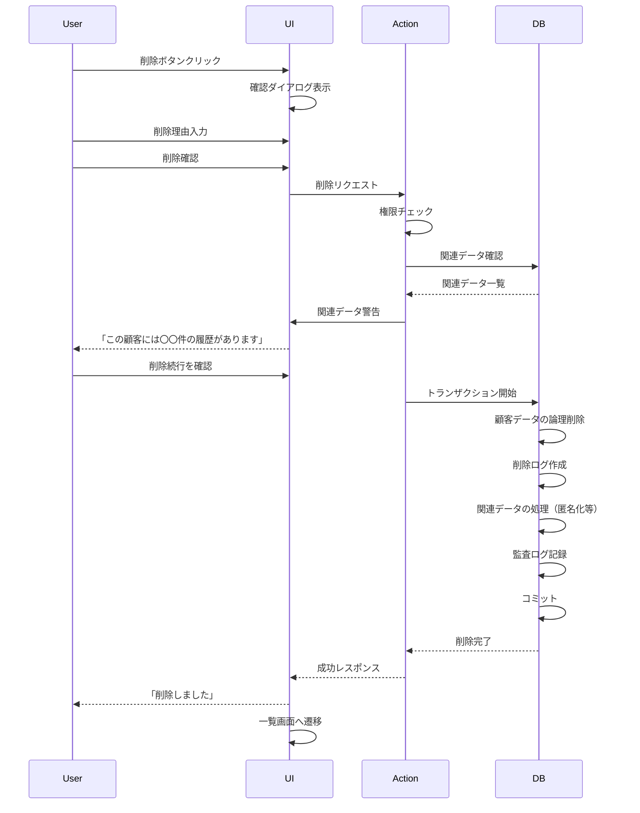

# 005: 顧客削除（論理削除）

## 機能概要

顧客データを論理削除する機能。物理的にはデータベースに残しながら、システム上は削除済みとして扱う。GDPR等の法的要件に対応し、誤削除時の復元や監査証跡の保持を可能にする。

## なぜ必要なのか

### ビジネス上の必要性
- **データ整理**: 重複顧客、テストデータ、誤登録の削除
- **法的要件**: GDPR「削除権（忘れられる権利）」への対応
- **顧客プライバシー**: 顧客からの削除要求への対応
- **データ品質**: 不要なデータを非表示にして管理しやすく

### システム上の必要性
- **参照整合性**: 関連データ（来店履歴、支払い等）を保持
- **監査証跡**: 削除の記録を残し、コンプライアンスに対応
- **復元可能性**: 誤削除からのリカバリー
- **データ分析**: 過去のデータを集計に含められる

## どのようなときに役立つのか

### 日常業務での活用

1. **重複顧客の整理**
   ```
   同一人物が2回登録されている発見
   ↓
   正しいデータを残して重複を削除
   ↓
   システムがスッキリ
   ```

2. **テストデータの削除**
   ```
   スタッフトレーニング用のテストデータ
   ↓
   本番運用開始前に一括削除
   ↓
   本物の顧客データのみに
   ```

3. **顧客からの削除要求（GDPR）**
   ```
   顧客: 「個人情報を削除してください」
   ↓
   スタッフが削除処理
   ↓
   システム上は非表示に
   ↓
   法的義務の履行
   ```

4. **誤登録の削除**
   ```
   入力ミスで作成してしまった顧客
   ↓
   即座に削除
   ↓
   データの品質維持
   ```

5. **長期未来店顧客の整理**
   ```
   5年以上来店のない顧客
   ↓
   定期的にレビューして削除
   ↓
   アクティブな顧客リストの維持
   ```

### 具体的なシナリオ

**シナリオ1: 重複顧客の発見と削除**
```
検索で「山田太郎」が2件ヒット
↓
スタッフが詳細確認
→ 電話番号、住所が同じ
→ 同一人物と判断
↓
古いデータ（来店履歴なし）を削除選択
↓
確認ダイアログ表示
「本当に削除しますか？この操作は取り消せません」
↓
削除理由入力: 「重複データのため」
↓
論理削除実行
↓
リストから消える（データベースには残る）
```

**シナリオ2: GDPR削除要求への対応**
```
顧客からメール
「GDPRに基づき、私の個人情報を削除してください」
↓
スタッフが顧客を検索
↓
削除画面で「GDPR削除要求」を選択
↓
関連データの処理オプション表示
- 来店履歴: 匿名化
- 支払い履歴: 保持（会計記録として必要）
- 写真: 完全削除
↓
削除実行
↓
顧客に削除完了メール送信
```

**シナリオ3: 誤削除からの復元**
```
スタッフが誤って顧客を削除
↓
すぐに気づいて上司に報告
↓
管理者権限で「削除済み顧客」画面へ
↓
該当顧客を検索
↓
「復元」ボタンクリック
↓
顧客データが復活
↓
業務への影響を最小化
```

## 重要度評価

### 優先度: P0 (Critical - 最優先)

### 理由

1. **CRUD操作の完結**
   - Create, Read, Update, Delete の D
   - 基本的なデータ管理機能として必須
   - この機能なしではデータが溜まる一方

2. **法的コンプライアンス**
   - GDPR: 削除権（Right to Erasure）
   - 個人情報保護法: 利用停止請求への対応
   - 法的義務を果たせない = ビジネスリスク

3. **データ品質管理**
   - 誤データ、重複データの削除
   - テストデータのクリーンアップ
   - データベースの健全性維持

4. **誤操作への対応**
   - 論理削除により復元可能
   - 物理削除だと取り返しがつかない
   - ビジネス継続性の確保

5. **監査要件**
   - 削除の記録を残す必要
   - 誰がいつ削除したかの証跡
   - コンプライアンス監査への対応

## 基本設計

### システム構成

```
┌──────────────────┐
│   削除UI         │
│  ・確認ダイアログ │
│  ・理由入力      │
└────────┬─────────┘
         │ Server Action
         ↓
┌──────────────────┐
│  削除処理        │
│  ・権限チェック   │
│  ・関連データ処理 │
│  ・監査ログ      │
└────────┬─────────┘
         │ Transaction
         ↓
┌──────────────────┐
│  Database        │
│  ・論理削除      │
│  ・deletedAt設定│
└──────────────────┘
```

### データ構造

```typescript
type Customer = {
  // ... 他のフィールド
  deletedAt: Date | null; // 削除日時（null = 未削除）
  deletedBy: string | null; // 削除者ID
  deleteReason: string | null; // 削除理由
};

type CustomerDeletionLog = {
  id: string;
  customerId: string;
  customerData: Record<string, unknown>; // 削除時のスナップショット
  deletedBy: string;
  deletedAt: Date;
  reason: string;
  relatedDataAction: 'anonymize' | 'keep' | 'delete'; // 関連データの処理方法
  gdprRequest: boolean; // GDPR要求かどうか
  restoredAt: Date | null; // 復元日時
  restoredBy: string | null; // 復元者ID
};
```

### 処理フロー



## 詳細設計

### API仕様

```typescript
type DeleteCustomerInput = {
  customerId: string;
  reason: string; // 必須
  gdprRequest?: boolean; // GDPR要求かどうか
  relatedDataAction?: 'anonymize' | 'keep'; // デフォルト: keep
};

/**
 * 顧客を論理削除する
 */
async function deleteCustomer(
  input: DeleteCustomerInput
): Promise<Result<void, Error>> {
  // 1. 認証・権限チェック
  const session = await getSession();
  if (!session || !hasPermission(session.user, 'customer:delete')) {
    return { success: false, error: 'Forbidden' };
  }

  // 2. 顧客の存在確認
  const customer = await db.customers.findUnique({
    where: { id: input.customerId, deletedAt: null }
  });

  if (!customer) {
    return { success: false, error: 'Customer not found' };
  }

  // 3. 関連データの確認
  const relatedData = await checkRelatedData(input.customerId);

  try {
    await db.transaction(async (tx) => {
      // 4. 顧客データのスナップショット保存
      await tx.customerDeletionLogs.create({
        data: {
          customerId: input.customerId,
          customerData: customer,
          deletedBy: session.user.id,
          deletedAt: new Date(),
          reason: input.reason,
          relatedDataAction: input.relatedDataAction || 'keep',
          gdprRequest: input.gdprRequest || false,
        }
      });

      // 5. 関連データの処理
      if (input.relatedDataAction === 'anonymize') {
        await anonymizeRelatedData(tx, input.customerId);
      }

      // 6. 顧客データの論理削除
      await tx.customers.update({
        where: { id: input.customerId },
        data: {
          deletedAt: new Date(),
          deletedBy: session.user.id,
          deleteReason: input.reason,
        }
      });

      // 7. 監査ログ
      await tx.auditLogs.create({
        data: {
          action: 'customer.delete',
          userId: session.user.id,
          resourceType: 'customer',
          resourceId: input.customerId,
          details: {
            reason: input.reason,
            gdprRequest: input.gdprRequest,
            relatedDataCount: relatedData.total,
          },
        }
      });
    });

    // 8. キャッシュ無効化
    revalidateTag('customers');
    revalidateTag(`customer-${input.customerId}`);

    // 9. GDPR要求の場合、顧客に通知
    if (input.gdprRequest) {
      await sendGDPRDeletionNotification(customer.email);
    }

    return { success: true };

  } catch (error) {
    logger.error('Failed to delete customer', { error, input });
    return { success: false, error: 'Delete failed' };
  }
}

// 関連データの確認
async function checkRelatedData(customerId: string) {
  const [visits, appointments, payments, records, photos] = await Promise.all([
    db.visits.count({ where: { customerId } }),
    db.appointments.count({ where: { customerId } }),
    db.payments.count({ where: { customerId } }),
    db.records.count({ where: { customerId } }),
    db.photos.count({ where: { customerId } }),
  ]);

  return {
    visits,
    appointments,
    payments,
    records,
    photos,
    total: visits + appointments + payments + records + photos,
  };
}

// 関連データの匿名化
async function anonymizeRelatedData(tx: Transaction, customerId: string) {
  // 来店履歴は保持するが、顧客情報を匿名化
  await tx.visits.updateMany({
    where: { customerId },
    data: {
      customerName: '削除済み顧客',
      notes: '[顧客の要求により削除]',
    }
  });

  // カルテは匿名化
  await tx.records.updateMany({
    where: { customerId },
    data: {
      content: '[顧客の要求により削除]',
    }
  });

  // 写真は物理削除
  const photos = await tx.photos.findMany({
    where: { customerId }
  });

  for (const photo of photos) {
    await deletePhotoFile(photo.url);
  }

  await tx.photos.deleteMany({
    where: { customerId }
  });
}
```

### 復元機能

```typescript
/**
 * 削除済み顧客を復元する
 */
async function restoreCustomer(
  customerId: string
): Promise<Result<Customer, Error>> {
  const session = await getSession();

  if (!hasPermission(session.user, 'customer:restore')) {
    return { success: false, error: 'Forbidden' };
  }

  try {
    const customer = await db.transaction(async (tx) => {
      // 削除済み顧客を取得
      const deleted = await tx.customers.findUnique({
        where: { id: customerId }
      });

      if (!deleted || !deleted.deletedAt) {
        throw new Error('Customer not found or not deleted');
      }

      // 復元
      const restored = await tx.customers.update({
        where: { id: customerId },
        data: {
          deletedAt: null,
          deletedBy: null,
          deleteReason: null,
        }
      });

      // 削除ログに復元記録
      await tx.customerDeletionLogs.updateMany({
        where: {
          customerId,
          restoredAt: null,
        },
        data: {
          restoredAt: new Date(),
          restoredBy: session.user.id,
        }
      });

      // 監査ログ
      await tx.auditLogs.create({
        data: {
          action: 'customer.restore',
          userId: session.user.id,
          resourceType: 'customer',
          resourceId: customerId,
        }
      });

      return restored;
    });

    revalidateTag('customers');
    revalidateTag(`customer-${customerId}`);

    return { success: true, data: customer };

  } catch (error) {
    logger.error('Failed to restore customer', { error, customerId });
    return { success: false, error: 'Restore failed' };
  }
}
```

### UI/UX設計

```typescript
// 削除確認ダイアログ
function DeleteCustomerDialog({
  customer,
  open,
  onClose,
}: {
  customer: Customer;
  open: boolean;
  onClose: () => void;
}) {
  const [reason, setReason] = useState('');
  const [relatedData, setRelatedData] = useState<RelatedDataCount | null>(null);
  const [isGDPR, setIsGDPR] = useState(false);
  const [actionType, setActionType] = useState<'keep' | 'anonymize'>('keep');

  useEffect(() => {
    if (open) {
      // 関連データを取得
      checkRelatedData(customer.id).then(setRelatedData);
    }
  }, [open, customer.id]);

  async function handleDelete() {
    const result = await deleteCustomer({
      customerId: customer.id,
      reason,
      gdprRequest: isGDPR,
      relatedDataAction: actionType,
    });

    if (result.success) {
      toast.success('顧客を削除しました');
      onClose();
      router.push('/customers');
    } else {
      toast.error('削除に失敗しました');
    }
  }

  return (
    <Dialog open={open} onOpenChange={onClose}>
      <DialogContent className="max-w-md">
        <DialogHeader>
          <DialogTitle className="flex items-center gap-2">
            <AlertTriangle className="text-destructive" />
            顧客の削除
          </DialogTitle>
          <DialogDescription>
            {customer.lastName} {customer.firstName} さんを削除します。
            この操作は取り消せません。
          </DialogDescription>
        </DialogHeader>

        {relatedData && relatedData.total > 0 && (
          <Alert variant="warning">
            <AlertDescription>
              この顧客には以下のデータがあります：
              <ul className="mt-2 ml-4 list-disc">
                {relatedData.visits > 0 && (
                  <li>来店履歴: {relatedData.visits}件</li>
                )}
                {relatedData.records > 0 && (
                  <li>カルテ: {relatedData.records}件</li>
                )}
                {relatedData.payments > 0 && (
                  <li>支払い: {relatedData.payments}件</li>
                )}
              </ul>
            </AlertDescription>
          </Alert>
        )}

        <div className="space-y-4">
          <div>
            <Label htmlFor="reason">削除理由 *</Label>
            <Textarea
              id="reason"
              value={reason}
              onChange={(e) => setReason(e.target.value)}
              placeholder="削除する理由を入力してください"
              required
            />
          </div>

          <div className="flex items-center space-x-2">
            <Checkbox
              id="gdpr"
              checked={isGDPR}
              onCheckedChange={(checked) => setIsGDPR(checked as boolean)}
            />
            <Label htmlFor="gdpr">GDPR削除要求</Label>
          </div>

          {relatedData && relatedData.total > 0 && (
            <div>
              <Label>関連データの処理</Label>
              <RadioGroup value={actionType} onValueChange={setActionType as any}>
                <div className="flex items-center space-x-2">
                  <RadioGroupItem value="keep" id="keep" />
                  <Label htmlFor="keep">保持する（推奨）</Label>
                </div>
                <div className="flex items-center space-x-2">
                  <RadioGroupItem value="anonymize" id="anonymize" />
                  <Label htmlFor="anonymize">匿名化する</Label>
                </div>
              </RadioGroup>
              <p className="text-xs text-muted-foreground mt-1">
                ※ 会計記録は法的に保持が必要なため、常に保持されます
              </p>
            </div>
          )}
        </div>

        <DialogFooter>
          <Button variant="outline" onClick={onClose}>
            キャンセル
          </Button>
          <Button
            variant="destructive"
            onClick={handleDelete}
            disabled={!reason.trim()}
          >
            削除する
          </Button>
        </DialogFooter>
      </DialogContent>
    </Dialog>
  );
}

// 削除済み顧客一覧
function DeletedCustomersPage() {
  const { data: deletedCustomers } = useQuery({
    queryKey: ['deleted-customers'],
    queryFn: getDeletedCustomers,
  });

  return (
    <div className="container mx-auto p-4">
      <h1>削除済み顧客</h1>

      <Table>
        <TableHeader>
          <TableRow>
            <TableHead>顧客番号</TableHead>
            <TableHead>名前</TableHead>
            <TableHead>削除日時</TableHead>
            <TableHead>削除者</TableHead>
            <TableHead>削除理由</TableHead>
            <TableHead>操作</TableHead>
          </TableRow>
        </TableHeader>
        <TableBody>
          {deletedCustomers?.map(customer => (
            <TableRow key={customer.id}>
              <TableCell>{customer.customerNumber}</TableCell>
              <TableCell>
                {customer.lastName} {customer.firstName}
              </TableCell>
              <TableCell>{formatDate(customer.deletedAt)}</TableCell>
              <TableCell>{customer.deletedBy.name}</TableCell>
              <TableCell>{customer.deleteReason}</TableCell>
              <TableCell>
                <Button
                  variant="outline"
                  size="sm"
                  onClick={() => restoreCustomer(customer.id)}
                >
                  復元
                </Button>
              </TableCell>
            </TableRow>
          ))}
        </TableBody>
      </Table>
    </div>
  );
}
```

### セキュリティ考慮事項

```typescript
// 削除権限の厳格な管理
const DELETE_PERMISSIONS = {
  'customer:delete': ['admin', 'manager'],
  'customer:delete:gdpr': ['admin', 'privacy-officer'],
  'customer:restore': ['admin'],
};

// 削除前の二段階認証
async function deleteCustomerWithMFA(input: DeleteCustomerInput) {
  const session = await getSession();

  // 重要な操作なので二段階認証を要求
  if (input.gdprRequest) {
    const mfaVerified = await verifyMFA(session.user.id);
    if (!mfaVerified) {
      return { success: false, error: 'MFA required' };
    }
  }

  return await deleteCustomer(input);
}

// 削除可能期間の制限（誤操作防止）
async function canDeleteCustomer(customerId: string): Promise<boolean> {
  const customer = await db.customers.findUnique({
    where: { id: customerId }
  });

  // 最終来店から1年以内は削除不可（誤操作防止）
  const lastVisit = await db.visits.findFirst({
    where: { customerId },
    orderBy: { date: 'desc' }
  });

  if (lastVisit && differenceInDays(new Date(), lastVisit.date) < 365) {
    return false;
  }

  return true;
}
```

### テスト方針

```typescript
describe('deleteCustomer', () => {
  test('顧客を論理削除できる', async () => {
    const customer = await createTestCustomer();

    const result = await deleteCustomer({
      customerId: customer.id,
      reason: 'テストのため'
    });

    expect(result.success).toBe(true);

    // 論理削除されている
    const deleted = await db.customers.findUnique({
      where: { id: customer.id }
    });
    expect(deleted.deletedAt).not.toBeNull();

    // 通常の検索では出てこない
    const customers = await db.customers.findMany({
      where: { deletedAt: null }
    });
    expect(customers.find(c => c.id === customer.id)).toBeUndefined();

    // 削除ログが作成されている
    const log = await db.customerDeletionLogs.findFirst({
      where: { customerId: customer.id }
    });
    expect(log).not.toBeNull();
  });

  test('削除済み顧客を復元できる', async () => {
    const customer = await createTestCustomer();
    await deleteCustomer({
      customerId: customer.id,
      reason: 'テスト'
    });

    const result = await restoreCustomer(customer.id);

    expect(result.success).toBe(true);

    // 復元されている
    const restored = await db.customers.findUnique({
      where: { id: customer.id }
    });
    expect(restored.deletedAt).toBeNull();
  });

  test('権限がないユーザーは削除できない', async () => {
    const customer = await createTestCustomer();
    const limitedUser = await createTestUser({ role: 'staff' });

    const result = await deleteCustomer({
      customerId: customer.id,
      reason: 'テスト'
    });

    expect(result.success).toBe(false);
    expect(result.error).toBe('Forbidden');
  });
});
```

## まとめ

顧客削除機能は、データ管理とコンプライアンスに必須の機能です。

### 重要ポイント
1. **論理削除**: データを保持しつつ非表示に
2. **復元可能**: 誤削除からのリカバリー
3. **GDPR対応**: 法的要件への準拠
4. **監査証跡**: すべての削除を記録

### 成功指標
- 削除から復元までの時間: 5分以内
- 誤削除の復元率: 100%
- GDPR要求への対応時間: 30日以内
