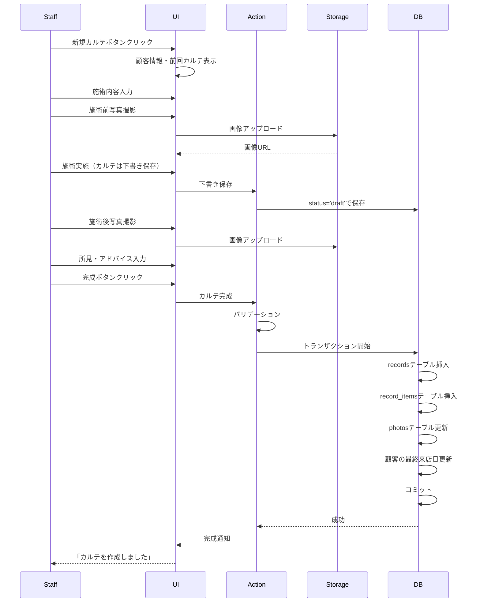

# 007: カルテ作成

## 機能概要

顧客の来店時に新しいカルテ（診療記録/施術記録）を作成する機能。施術内容、顧客の状態、使用した薬剤・製品、スタッフの所見などを記録し、顧客の履歴として保存する。顧客カルテシステムの中核機能。

## なぜ必要なのか

### ビジネス上の必要性
- **サービス品質の向上**: 前回の施術内容を参照して適切なサービス提供
- **顧客満足度向上**: 顧客の好みや反応を記録し、パーソナライズ
- **安全性の確保**: アレルギー反応や副作用を記録し、事故防止
- **法的証拠**: 施術内容の記録は法的トラブル時の証拠になる
- **スタッフ間の情報共有**: 担当が変わっても一貫したサービス

### システム上の必要性
- **データの蓄積**: 顧客の履歴を時系列で記録
- **分析の基盤**: 施術効果の分析、トレンドの把握
- **売上との紐付け**: 施術内容と売上を関連付け

## どのようなときに役立つのか

### 日常業務での活用

1. **施術後の記録**
   ```
   施術完了後、スタッフがタブレットで記録
   ↓
   - 施術内容
   - 使用した製品
   - 顧客の反応
   - 次回の提案
   ↓
   デジタルカルテとして保存
   ```

2. **次回来店時の参照**
   ```
   顧客が再来店
   ↓
   前回のカルテを表示
   ↓
   「前回は〇〇を使用しましたね」
   「お肌の調子はいかがでしたか?」
   ↓
   スムーズなカウンセリング
   ```

3. **ビフォーアフター記録**
   ```
   施術前の写真撮影
   ↓
   カルテに添付
   ↓
   施術実施
   ↓
   施術後の写真撮影
   ↓
   ビフォーアフター比較
   ```

4. **アレルギー・トラブルの記録**
   ```
   施術中に軽い赤みが発生
   ↓
   即座にカルテに記録
   ↓
   「〇〇製品で軽度の反応あり」
   ↓
   次回から該当製品を避ける
   ```

## 重要度評価

### 優先度: P0 (Critical - 最優先)

### 理由

1. **システムの中核機能**
   - 「カルテシステム」の名前の由来となる機能
   - この機能なしではシステムの存在意義がない
   - すべての施術で使用される

2. **法的要件**
   - 医療・美容業界では施術記録の保管が義務
   - トラブル時の証拠として重要
   - 記録がないと訴訟リスク

3. **ビジネス価値**
   - サービス品質の差別化要因
   - 顧客満足度に直結
   - リピート率向上の鍵

4. **高頻度利用**
   - 毎回の施術で必ず使用
   - 1日に数十回作成される
   - システムで最も使われる機能の一つ

## 基本設計

### システム構成

```
┌────────────────────┐
│  カルテ作成フォーム │
│  ・基本情報        │
│  ・施術内容        │
│  ・写真添付        │
│  ・所見記入        │
└──────┬─────────────┘
       │ Server Action
       ↓
┌────────────────────┐
│  カルテ作成処理    │
│  ・バリデーション   │
│  ・画像アップロード │
│  ・関連データ登録   │
└──────┬─────────────┘
       │ Transaction
       ↓
┌────────────────────┐
│  Database          │
│  ・records         │
│  ・record_items    │
│  ・photos          │
└────────────────────┘
```

### データ構造

```typescript
type MedicalRecord = {
  id: string;
  recordNumber: string; // カルテ番号（例: R202401010001）
  customerId: string;
  visitId: string | null; // 来店記録との紐付け

  // 日時・担当者
  recordDate: Date;
  staffId: string; // 担当スタッフ

  // 施術情報
  serviceIds: string[]; // 実施したサービス
  duration: number; // 所要時間（分）

  // 状態記録
  beforeCondition: string; // 施術前の状態
  afterCondition: string; // 施術後の状態

  // 施術詳細
  content: string; // 施術内容の詳細
  productsUsed: ProductUsage[]; // 使用した製品
  techniques: string[]; // 使用した技術・手法

  // 顧客の反応
  customerFeedback: string | null; // 顧客のコメント
  customerSatisfaction: number | null; // 満足度 (1-5)

  // スタッフ所見
  observation: string; // スタッフの所見
  advice: string | null; // 顧客へのアドバイス
  nextRecommendation: string | null; // 次回の推奨

  // アラート
  allergicReaction: boolean; // アレルギー反応の有無
  adverseEffect: boolean; // 副作用の有無
  alertNotes: string | null; // 注意事項

  // 写真
  beforePhotoIds: string[]; // 施術前写真
  afterPhotoIds: string[]; // 施術後写真

  // ステータス
  status: 'draft' | 'completed' | 'approved'; // 下書き/完成/承認済み

  // メタデータ
  createdAt: Date;
  updatedAt: Date;
  createdBy: string;
  updatedBy: string;
  approvedBy: string | null; // 承認者
  approvedAt: Date | null; // 承認日時
};

type ProductUsage = {
  productId: string;
  productName: string;
  quantity: number;
  unit: string; // ml, g, etc.
  batchNumber: string | null; // ロット番号
};
```

### 処理フロー



## 詳細設計

### API仕様

```typescript
type CreateRecordInput = {
  customerId: string;
  visitId?: string;
  recordDate: Date;
  serviceIds: string[];
  beforeCondition: string;
  content: string;
  productsUsed: ProductUsage[];
  observation: string;
  beforePhotoUrls?: string[];
  afterPhotoUrls?: string[];
  advice?: string;
  nextRecommendation?: string;
  allergicReaction?: boolean;
  adverseEffect?: boolean;
  alertNotes?: string;
  status: 'draft' | 'completed';
};

async function createMedicalRecord(
  input: CreateRecordInput
): Promise<Result<MedicalRecord, Error>> {
  const session = await getSession();

  if (!hasPermission(session.user, 'record:create')) {
    return { success: false, error: 'Forbidden' };
  }

  // バリデーション
  const validation = validateRecordInput(input);
  if (!validation.success) {
    return { success: false, errors: validation.errors };
  }

  try {
    const record = await db.transaction(async (tx) => {
      // カルテ番号生成
      const recordNumber = await generateRecordNumber();

      // カルテ作成
      const newRecord = await tx.medicalRecords.create({
        data: {
          recordNumber,
          customerId: input.customerId,
          visitId: input.visitId,
          recordDate: input.recordDate,
          staffId: session.user.id,
          serviceIds: input.serviceIds,
          beforeCondition: input.beforeCondition,
          content: input.content,
          observation: input.observation,
          advice: input.advice,
          nextRecommendation: input.nextRecommendation,
          allergicReaction: input.allergicReaction || false,
          adverseEffect: input.adverseEffect || false,
          alertNotes: input.alertNotes,
          status: input.status,
          createdBy: session.user.id,
          updatedBy: session.user.id,
        }
      });

      // 使用製品の記録
      for (const product of input.productsUsed) {
        await tx.recordItems.create({
          data: {
            recordId: newRecord.id,
            productId: product.productId,
            quantity: product.quantity,
            unit: product.unit,
            batchNumber: product.batchNumber,
          }
        });

        // 在庫から減算
        await tx.products.update({
          where: { id: product.productId },
          data: {
            stock: {
              decrement: product.quantity
            }
          }
        });
      }

      // 写真の紐付け
      if (input.beforePhotoUrls) {
        for (const url of input.beforePhotoUrls) {
          await tx.photos.create({
            data: {
              url,
              customerId: input.customerId,
              recordId: newRecord.id,
              type: 'before',
              takenAt: input.recordDate,
              takenBy: session.user.id,
            }
          });
        }
      }

      if (input.afterPhotoUrls) {
        for (const url of input.afterPhotoUrls) {
          await tx.photos.create({
            data: {
              url,
              customerId: input.customerId,
              recordId: newRecord.id,
              type: 'after',
              takenAt: input.recordDate,
              takenBy: session.user.id,
            }
          });
        }
      }

      // 顧客の最終来店日を更新
      await tx.customers.update({
        where: { id: input.customerId },
        data: {
          lastVisit: input.recordDate,
          totalVisits: { increment: 1 },
        }
      });

      // アラートがある場合、顧客情報に反映
      if (input.allergicReaction || input.adverseEffect) {
        await tx.customers.update({
          where: { id: input.customerId },
          data: {
            hasAlerts: true,
          }
        });
      }

      return newRecord;
    });

    // キャッシュ無効化
    revalidateTag(`customer-${input.customerId}`);
    revalidateTag('records');

    return { success: true, data: record };

  } catch (error) {
    logger.error('Failed to create record', { error, input });
    return { success: false, error: 'Failed to create record' };
  }
}

// カルテ番号生成
async function generateRecordNumber(): Promise<string> {
  const today = new Date();
  const datePrefix = format(today, 'yyyyMMdd');

  const lastRecord = await db.medicalRecords.findFirst({
    where: {
      recordNumber: {
        startsWith: `R${datePrefix}`
      }
    },
    orderBy: {
      recordNumber: 'desc'
    }
  });

  let sequence = 1;
  if (lastRecord) {
    const lastSequence = parseInt(lastRecord.recordNumber.slice(-4));
    sequence = lastSequence + 1;
  }

  return `R${datePrefix}${sequence.toString().padStart(4, '0')}`;
}
```

### UI/UX設計

```typescript
function CreateRecordPage({ customerId }: { customerId: string }) {
  const { data: customer } = useQuery({
    queryKey: ['customer', customerId],
    queryFn: () => getCustomer(customerId),
  });

  const { data: lastRecord } = useQuery({
    queryKey: ['last-record', customerId],
    queryFn: () => getLastRecord(customerId),
  });

  return (
    <div className="container mx-auto p-4">
      <div className="flex justify-between items-center mb-4">
        <h1>カルテ作成</h1>
        <CustomerInfo customer={customer} />
      </div>

      {/* 前回のカルテ参照 */}
      {lastRecord && (
        <Alert className="mb-4">
          <InfoIcon />
          <AlertTitle>前回のカルテ</AlertTitle>
          <AlertDescription>
            {formatDate(lastRecord.recordDate)} - {lastRecord.observation}
            <Button variant="link" onClick={() => viewRecord(lastRecord.id)}>
              詳細を見る
            </Button>
          </AlertDescription>
        </Alert>
      )}

      <RecordForm customerId={customerId} lastRecord={lastRecord} />
    </div>
  );
}

function RecordForm({ customerId, lastRecord }: RecordFormProps) {
  const [formData, setFormData] = useState<CreateRecordInput>({
    customerId,
    recordDate: new Date(),
    serviceIds: [],
    beforeCondition: lastRecord?.afterCondition || '',
    content: '',
    productsUsed: [],
    observation: '',
    status: 'draft',
  });

  const [beforePhotos, setBeforePhotos] = useState<File[]>([]);
  const [afterPhotos, setAfterPhotos] = useState<File[]>([]);
  const [autoSaveEnabled, setAutoSaveEnabled] = useState(true);

  // 自動保存（下書き）
  useEffect(() => {
    if (autoSaveEnabled && formData.content) {
      const timer = setTimeout(() => {
        saveDraft(formData);
      }, 5000); // 5秒ごと

      return () => clearTimeout(timer);
    }
  }, [formData, autoSaveEnabled]);

  async function handleSubmit(status: 'draft' | 'completed') {
    // 写真をアップロード
    const beforePhotoUrls = await uploadPhotos(beforePhotos);
    const afterPhotoUrls = await uploadPhotos(afterPhotos);

    const result = await createMedicalRecord({
      ...formData,
      beforePhotoUrls,
      afterPhotoUrls,
      status,
    });

    if (result.success) {
      toast.success('カルテを作成しました');
      router.push(`/customers/${customerId}`);
    } else {
      toast.error('カルテの作成に失敗しました');
    }
  }

  return (
    <Form>
      <Tabs defaultValue="basic">
        <TabsList>
          <TabsTrigger value="basic">基本情報</TabsTrigger>
          <TabsTrigger value="treatment">施術内容</TabsTrigger>
          <TabsTrigger value="photos">写真</TabsTrigger>
          <TabsTrigger value="observation">所見・アドバイス</TabsTrigger>
        </TabsList>

        <TabsContent value="basic">
          <Card>
            <CardHeader>
              <CardTitle>基本情報</CardTitle>
            </CardHeader>
            <CardContent className="space-y-4">
              <div>
                <Label>施術日</Label>
                <DatePicker
                  value={formData.recordDate}
                  onChange={(date) => setFormData({ ...formData, recordDate: date })}
                />
              </div>

              <div>
                <Label>実施サービス *</Label>
                <ServiceSelector
                  value={formData.serviceIds}
                  onChange={(ids) => setFormData({ ...formData, serviceIds: ids })}
                />
              </div>

              <div>
                <Label>施術前の状態 *</Label>
                <Textarea
                  value={formData.beforeCondition}
                  onChange={(e) => setFormData({
                    ...formData,
                    beforeCondition: e.target.value
                  })}
                  placeholder="肌の状態、気になる箇所など"
                  rows={4}
                />
              </div>
            </CardContent>
          </Card>
        </TabsContent>

        <TabsContent value="treatment">
          <Card>
            <CardHeader>
              <CardTitle>施術内容</CardTitle>
            </CardHeader>
            <CardContent className="space-y-4">
              <div>
                <Label>施術の詳細 *</Label>
                <RichTextEditor
                  value={formData.content}
                  onChange={(content) => setFormData({ ...formData, content })}
                  placeholder="施術の詳しい内容を記録してください"
                />
              </div>

              <div>
                <Label>使用製品</Label>
                <ProductSelector
                  value={formData.productsUsed}
                  onChange={(products) => setFormData({
                    ...formData,
                    productsUsed: products
                  })}
                />
              </div>

              {/* アラート */}
              <div className="space-y-2">
                <div className="flex items-center space-x-2">
                  <Checkbox
                    id="allergic"
                    checked={formData.allergicReaction}
                    onCheckedChange={(checked) => setFormData({
                      ...formData,
                      allergicReaction: checked as boolean
                    })}
                  />
                  <Label htmlFor="allergic" className="text-destructive">
                    アレルギー反応あり
                  </Label>
                </div>

                <div className="flex items-center space-x-2">
                  <Checkbox
                    id="adverse"
                    checked={formData.adverseEffect}
                    onCheckedChange={(checked) => setFormData({
                      ...formData,
                      adverseEffect: checked as boolean
                    })}
                  />
                  <Label htmlFor="adverse" className="text-destructive">
                    副作用あり
                  </Label>
                </div>

                {(formData.allergicReaction || formData.adverseEffect) && (
                  <Textarea
                    value={formData.alertNotes}
                    onChange={(e) => setFormData({
                      ...formData,
                      alertNotes: e.target.value
                    })}
                    placeholder="詳細を記録してください"
                    className="border-destructive"
                  />
                )}
              </div>
            </CardContent>
          </Card>
        </TabsContent>

        <TabsContent value="photos">
          <Card>
            <CardHeader>
              <CardTitle>写真</CardTitle>
            </CardHeader>
            <CardContent className="space-y-6">
              <div>
                <Label>施術前写真</Label>
                <PhotoUploader
                  photos={beforePhotos}
                  onChange={setBeforePhotos}
                  maxPhotos={5}
                />
              </div>

              <Separator />

              <div>
                <Label>施術後写真</Label>
                <PhotoUploader
                  photos={afterPhotos}
                  onChange={setAfterPhotos}
                  maxPhotos={5}
                />
              </div>

              {beforePhotos.length > 0 && afterPhotos.length > 0 && (
                <BeforeAfterComparison
                  before={beforePhotos[0]}
                  after={afterPhotos[0]}
                />
              )}
            </CardContent>
          </Card>
        </TabsContent>

        <TabsContent value="observation">
          <Card>
            <CardHeader>
              <CardTitle>所見・アドバイス</CardTitle>
            </CardHeader>
            <CardContent className="space-y-4">
              <div>
                <Label>スタッフ所見 *</Label>
                <Textarea
                  value={formData.observation}
                  onChange={(e) => setFormData({
                    ...formData,
                    observation: e.target.value
                  })}
                  placeholder="施術後の状態、気づいた点など"
                  rows={4}
                />
              </div>

              <div>
                <Label>顧客へのアドバイス</Label>
                <Textarea
                  value={formData.advice}
                  onChange={(e) => setFormData({
                    ...formData,
                    advice: e.target.value
                  })}
                  placeholder="ホームケアのアドバイスなど"
                  rows={3}
                />
              </div>

              <div>
                <Label>次回の推奨</Label>
                <Textarea
                  value={formData.nextRecommendation}
                  onChange={(e) => setFormData({
                    ...formData,
                    nextRecommendation: e.target.value
                  })}
                  placeholder="次回来店時の推奨施術など"
                  rows={3}
                />
              </div>
            </CardContent>
          </Card>
        </TabsContent>
      </Tabs>

      <div className="flex justify-between mt-6">
        <Button variant="outline" onClick={() => handleSubmit('draft')}>
          下書き保存
        </Button>
        <Button onClick={() => handleSubmit('completed')}>
          カルテ作成完了
        </Button>
      </div>

      {autoSaveEnabled && (
        <p className="text-xs text-muted-foreground mt-2">
          自動保存が有効です（5秒ごと）
        </p>
      )}
    </Form>
  );
}
```

### テンプレート機能

```typescript
// よく使う記録内容をテンプレートとして保存
type RecordTemplate = {
  id: string;
  name: string;
  serviceIds: string[];
  content: string;
  productsUsed: ProductUsage[];
  createdBy: string;
};

function TemplateSelector({ onSelect }: { onSelect: (template: RecordTemplate) => void }) {
  const { data: templates } = useQuery({
    queryKey: ['record-templates'],
    queryFn: getRecordTemplates,
  });

  return (
    <Select onValueChange={(id) => {
      const template = templates.find(t => t.id === id);
      if (template) onSelect(template);
    }}>
      <SelectTrigger>
        <SelectValue placeholder="テンプレートから選択" />
      </SelectTrigger>
      <SelectContent>
        {templates?.map(template => (
          <SelectItem key={template.id} value={template.id}>
            {template.name}
          </SelectItem>
        ))}
      </SelectContent>
    </Select>
  );
}
```

## まとめ

カルテ作成機能は顧客カルテシステムの中核であり、サービス品質と顧客満足度を左右する最重要機能です。

### 重要ポイント
1. **包括的な記録**: 施術内容、製品、写真、所見をすべて記録
2. **使いやすさ**: タブ形式、自動保存、テンプレートで効率化
3. **安全性**: アレルギー・副作用の記録で事故防止
4. **連携**: 在庫管理、写真管理、顧客情報と統合

### 成功指標
- カルテ作成率: 100%（すべての施術で作成）
- 作成時間: 平均5分以内
- 写真添付率: 80%以上
- スタッフ満足度: 4.5/5.0以上
